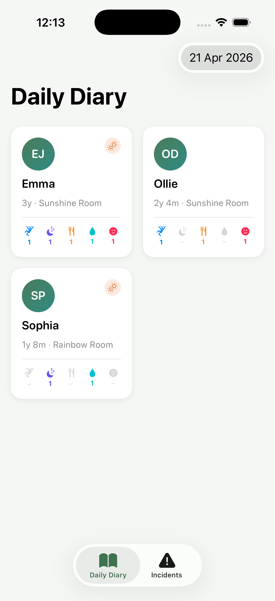
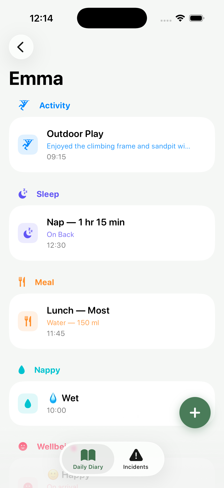
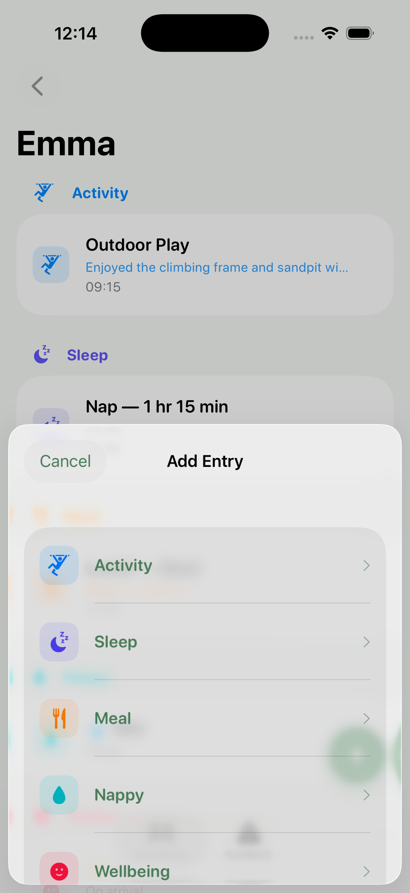
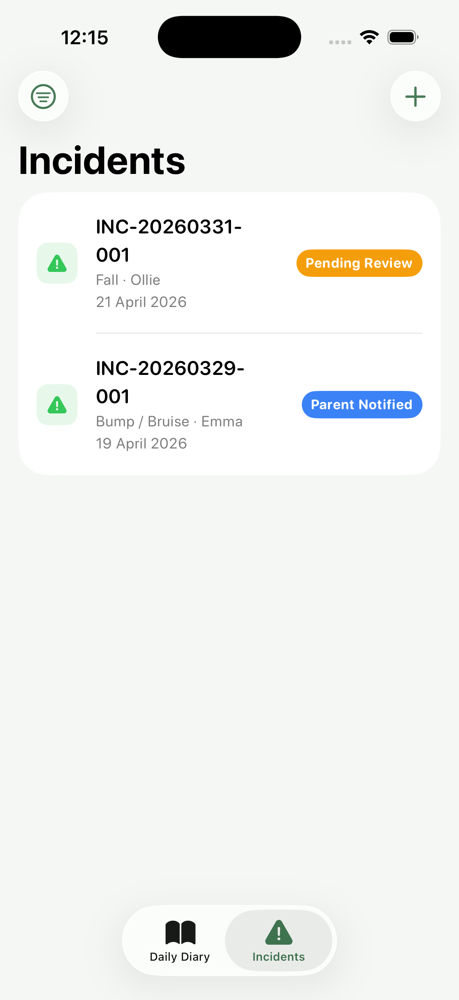
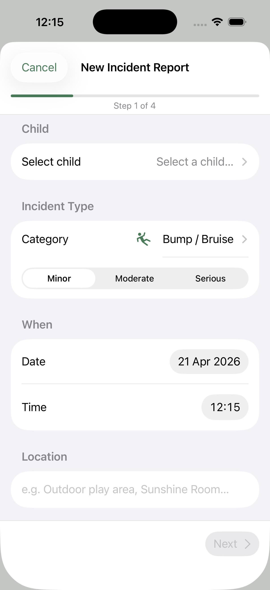
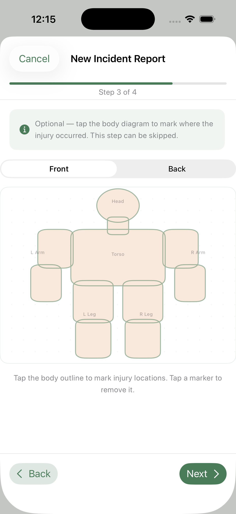
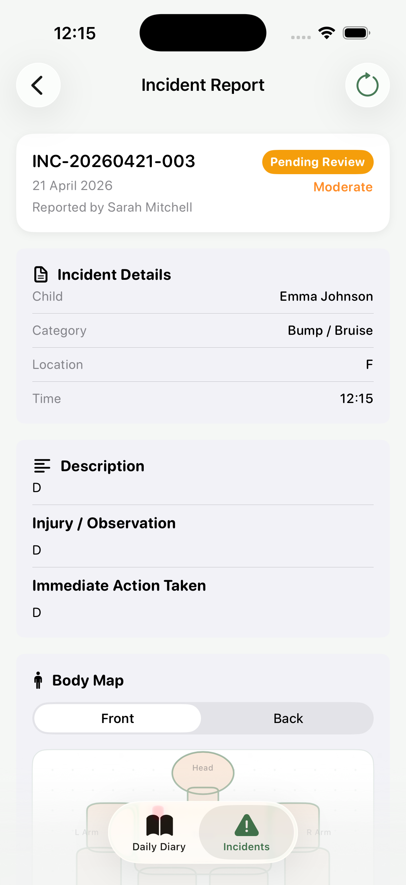

# SE4020 – Mobile Application Design & Development
## Assignment 01 — NurseryConnect iOS MVP

> **Submission Instructions:** Edit this file directly with your report. No separate documentation is required. Commit all your Swift/Xcode project files to this repository alongside this README.

---

## Student Details

| Field | Details |
|---|---|
| **Student ID** | IT22056320 |
| **Student Name** | Senevirathna K.M.U.T |
| **Chosen User Role** | Keyworker (Early Years Practitioner) |
| **Selected Feature 1** | Daily Diary & Activity Monitoring |
| **Selected Feature 2** | Digital Incident Reporting |

---

## 01. Feature Selection & Role Justification

### Chosen User Role

The **Keyworker (Early Years Practitioner)** was selected as the target user role. Keyworkers are the most operationally active role in the nursery, interacting with the system many times per day. Every child observation, sleep record, meal log, nappy change, mood check, and incident report flows through this role, making it the role most dependent on a well-designed mobile interface. Both chosen features are explicitly assigned to the Keyworker in the case study — the Keyworker is responsible for logging daily observations, recording meal intake, submitting incident reports, and maintaining child welfare records.

### Selected Features

**Feature 1: Daily Diary & Activity Monitoring**

A per-child daily diary allowing a Keyworker to log five entry types: Activity (title, category, description), Sleep (start/end time, duration, position), Meal (food offered, 6-point consumption scale, fluid intake), Nappy (type, cream applied), and Wellbeing/Mood (5-point scale, context notes). Entries are timestamped, attributed to the recording keyworker, and browsable by date via a DatePicker.

**Feature 2: Digital Incident Reporting**

A structured 4-step incident report wizard covering 7 RIDDOR-aligned categories, an interactive body map for injury location recording, and a 5-status management workflow (Draft → Pending Review → Reviewed & Approved → Parent Notified → Closed). Each report captures category, severity, location, description, immediate action taken, witness names, body map marks, and parent notification details.

### Justification

These features are deliberately paired to create a coherent Keyworker experience. The Daily Diary covers the routine, high-frequency care observations a keyworker records throughout every session. The Incident Reporting feature covers the less frequent but legally critical events that must be documented, reviewed, and communicated to parents.

Both features share the same `Child` model and design system. Together they cover the full spectrum of iOS development complexity — from simple data forms to Canvas-based custom drawing, multi-step wizard navigation, and enum-driven state machines — justifying a four-week MVP development scope.

---

## 02. App Functionality

### Overview

NurseryConnect launches directly into a two-tab interface. The **Daily Diary** tab shows a grid of assigned children; tapping a child opens their dated diary feed where entries can be added via a floating action button. The **Incidents** tab lists all incident reports with status filtering; tapping a report opens its full detail view, and a toolbar button opens the new incident wizard. All data is persisted locally using SwiftData with no backend or network layer required.

### Screen Descriptions

**Screen 1 — Diary Dashboard**

A `LazyVGrid` of `ChildCard` components showing each active child's name, age, room, allergy indicator, and today's entry count. A `DatePicker` in the toolbar allows viewing any past date. Tapping a card navigates to that child's diary feed.



**Screen 2 — Child Diary Feed**

A scrollable list of today's diary entries for the selected child, ordered by time. Each row shows the entry type icon (colour-coded), headline, subtitle, and timestamp. A floating `+` button opens the entry type picker sheet. Entries are filtered to the date selected on the dashboard.



**Screen 3 — New Diary Entry Form**

A sheet presenting the appropriate entry form for the selected type. Each form has type-specific fields: for example, the Meal form has a food name field, a capsule `MealAmount` selector (All / Most / Half / Little / None / Refused), and fluid intake fields. A Save button persists the entry to SwiftData and dismisses the sheet.



**Screen 4 — Incident List**

A list of all incident reports sorted by date (most recent first). Each row shows the child's name, incident category, reference number, and a colour-coded `StatusBadge`. A filter menu in the toolbar allows filtering by status. A "New Incident" toolbar button opens the incident wizard.



**Screen 5 — New Incident Wizard**

A 4-step modal form with a `ProgressView` bar. Step 1 collects child, category, severity, date, and location. Step 2 collects description, injury details, immediate action, and witnesses. Step 3 presents the interactive body map. Step 4 shows a full review before submission. The Next button is disabled until each step's required fields are filled.



**Screen 6 — Body Map**

An interactive `BodyMapView` embedded in Step 3 of the wizard. Displays a connected human silhouette built from a custom `BodySilhouette` Shape. Tapping inside the body places a red marker at normalised coordinates; tapping an existing marker removes it. A segmented Picker toggles between front and back views. Active markers display a pulsing ring animation.



**Screen 7 — Incident Detail**

A scrollable detail view showing all report fields: status header card, incident details, description, body map (read-only), manager review section, and parent notification section. A toolbar menu allows advancing the status. The Parent Notification section has a toggle for `parentNotifiedAt`, a method picker (In Person / Phone Call / Written Note), and a signature toggle.



### Navigation

The app uses a `TabView` at the root with two tabs, each owning its own `NavigationStack`:

- **Diary tab:** `DiaryDashboardView` → `ChildDiaryView` (via `navigationDestination`) → entry forms (sheet)
- **Incidents tab:** `IncidentListView` → `IncidentDetailView` (via `navigationDestination`); `NewIncidentFlow` (modal sheet)

This two-stack structure keeps the two features independently navigable and prevents navigation state from one tab affecting the other.

### Data Persistence

**SwiftData** (iOS 17) was chosen for persistence. It uses Swift macros (`@Model`, `@Relationship`) that eliminate Core Data boilerplate, and the `@Query` property wrapper binds model data directly to views without a separate ViewModel layer. All data is stored in a sandboxed SQLite database on-device.

Three `@Model` classes form the schema: `Child`, `DiaryEntry`, and `IncidentReport`. Cascade delete rules (`@Relationship(deleteRule: .cascade)`) on `Child.diaryEntries` and `Child.incidentReports` ensure all associated records are deleted when a child record is removed, preventing orphaned personal data.

### Error Handling

- **Step validation:** The `Next` button in `NewIncidentFlow` is disabled via a `stepIsValid: Bool` computed property until required fields are non-empty (after whitespace trimming). This prevents incomplete submissions without disruptive alert dialogues.
- **Status advancement:** The "Update Status" toolbar menu in `IncidentDetailView` is conditionally hidden when `report.nextStatuses.isEmpty`, preventing any attempt to advance a closed report.
- **Empty states:** Both `DiaryDashboardView` and `IncidentListView` use `ContentUnavailableView` to display a clear message when no records exist, rather than showing a blank screen.
- **SwiftData persistence:** The `ModelContainer` initialisation is wrapped in a `do/catch` block; failure calls `fatalError` with the localised error description for diagnostics.

---

## 03. User Interface Design

### Visual Design

A green-led palette was chosen to communicate trust, calm, and care — values central to professional childcare. All colours are defined as named Asset Catalog entries accessed via `extension Color` in `AppTheme.swift`:

| Role | Asset Name | Purpose |
|---|---|---|
| Brand Primary | PrimaryGreen | Primary actions, navigation titles, active states |
| Brand Secondary | PrimaryTeal | Supporting icons, secondary indicators |
| Accent / Alert | AccentOrange | Allergy warnings, alert states |
| Background | BackgroundPrimary | Page background — pale mint |
| Card Surface | CardBackground | Elevated content cards |

Typography uses SwiftUI's `.rounded` system font family at semantic scales (`cardTitle`, `sectionHead`, `bodySmall`, `displayName`), defined via `extension Font`. Rounded letterforms convey approachability while maintaining legibility, and all definitions respond automatically to Dynamic Type.

Each `DiaryEntryType` carries a `color: Color` computed property (blue for activity, indigo for sleep, orange for meal, teal for nappy, pink for wellbeing), applied consistently across timeline badges and entry rows for at-a-glance scanning.

### Usability

- **Floating action button (FAB):** The `+` button in `ChildDiaryView` uses `FABButtonStyle` with a spring press animation, giving immediate tactile feedback
- **Capsule amount selector:** `MealEntryForm` uses `AmountButtonStyle` for the `MealAmount` picker — a single tap selects and highlights an option, faster than a `Picker` drop-down during a busy mealtime
- **Inline step validation:** Disabled Next button in the wizard communicates missing fields without interrupting flow
- **Status badges:** `StatusBadge` renders each `IncidentStatus` with a distinct colour, giving at-a-glance status on list rows and the detail view header
- **Empty states:** `ContentUnavailableView` provides a clear message and icon rather than a blank list

### UI Components Used

```
TabView, NavigationStack, LazyVGrid, List, ScrollView,
Form, GroupBox, Sheet, ProgressView, DatePicker,
Picker (.segmented), Toggle, TextField, Menu,
Label, Button, Divider, ContentUnavailableView,
Canvas, GeometryReader, ZStack, VStack, HStack
```

Custom components: `BodySilhouette` (Shape), `BodyMapView`, `ChildCard`, `DiaryEntryRow`, `IncidentRowView`, `StatusBadge`, `EntryTypePicker`, `NurseryCardModifier` (ViewModifier), `AmountButtonStyle`, `FABButtonStyle`.

---

## 04. Swift & SwiftUI Knowledge

### Code Quality

The app is organised into clear groups mirroring the feature structure: `Models/`, `Diary/`, `Diary/Forms/`, `Diary/Components/`, `Incidents/`, `Incidents/Steps/`, `Incidents/Components/`, `Theme/`, and `Utilities/`. Each file contains a single type. All types use Swift naming conventions (PascalCase for types, camelCase for properties and methods).

Rather than full MVVM, the app uses a lightweight pattern where `@Query` binds model data directly to views and `@Environment(\.modelContext)` provides the persistence layer — appropriate for MVP scale. `@Bindable` is used in `IncidentDetailView` for direct model property binding without a ViewModel intermediary.

### Code Examples — Best Practices

**Example 1 — Incident Status State Machine**

The `IncidentStatus` enum encodes the entire incident workflow as a forward-only state machine. No view contains workflow logic — the enum is the sole authority on valid transitions.

```swift
enum IncidentStatus: String, CaseIterable, Codable {
    case draft            = "Draft"
    case pendingReview    = "Pending Review"
    case reviewedApproved = "Reviewed & Approved"
    case parentNotified   = "Parent Notified"
    case closed           = "Closed"
}

// On IncidentReport:
var nextStatuses: [IncidentStatus] {
    switch status {
    case .draft:            return [.pendingReview]
    case .pendingReview:    return [.reviewedApproved]
    case .reviewedApproved: return [.parentNotified]
    case .parentNotified:   return [.closed]
    case .closed:           return []
    }
}
```

`IncidentDetailView` reads `report.nextStatuses.isEmpty` to decide whether to show the toolbar menu, and `report.nextStatuses` to populate it — zero workflow logic in the view.

**Example 2 — Body Map Normalised Coordinates with Hit Testing**

Markers are stored at device-agnostic normalised coordinates and taps are validated against the silhouette path, preventing accidental placement outside the body outline.

```swift
.gesture(
    DragGesture(minimumDistance: 0)
        .onEnded { value in
            let tap = value.location
            let frame = CGRect(origin: .zero, size: geo.size)
            let silhouette = BodySilhouette(showFront: showingFront)
                .path(in: frame)

            guard silhouette.contains(tap) else { return }

            let nx = tap.x / geo.size.width
            let ny = tap.y / geo.size.height

            marks.append(BodyMapMark(
                xNormalized: nx,
                yNormalized: ny,
                isFrontView: showingFront,
                label: showingFront ? "Front" : "Back"
            ))
        }
)
```

### Advanced Concepts

- **Canvas API:** `BodyMapView` uses `Canvas` to render the dot-grid background and zone labels, avoiding the overhead of laying out individual view nodes for each element
- **Custom Shape:** `BodySilhouette` implements the `Shape` protocol, building a connected human figure from overlapping rounded-rect and ellipse segments whose filled union reads as a single silhouette
- **Spring and repeat animations:** `AmountButtonStyle` and `FABButtonStyle` use `.spring(response:dampingFraction:)` for press feedback; body map active markers use `.easeInOut(duration: 1.2).repeatForever(autoreverses: true)` for a pulse ring
- **Asymmetric transitions:** `NewIncidentFlow` step navigation uses `.asymmetric(insertion: .move(edge: .trailing), removal: .move(edge: .leading))` for a natural page-turn feel
- **@Bindable:** `IncidentDetailView` declares `@Bindable var report: IncidentReport` enabling direct two-way bindings to SwiftData model properties without a ViewModel

---

## 05. Testing & Debugging

### Testing

**Unit Tests** — 8 tests using Swift Testing (`@Test` macros) in `NurseryConnectTests`, all using in-memory `ModelContainer` instances:

```swift
@Test("Child.age returns 'X months' for infants under one year")
func childAgeInfant() throws {
    let container = try makeContainer(for: Child.self)
    let ctx = ModelContext(container)
    let dob = Calendar.current.date(byAdding: .month, value: -8, to: .now)!
    let child = Child(fullName: "Baby Test", preferredName: "Baby",
                      dateOfBirth: dob, roomName: "Babies")
    ctx.insert(child)
    #expect(child.age == "8 months")
}

@Test("IncidentReport.nextStatuses — closed status has no further transitions")
func statusWorkflowClosed() throws {
    let container = try makeContainer(for: IncidentReport.self)
    let ctx = ModelContext(container)
    let report = IncidentReport(
        referenceNumber: "INC-2026-04-15-002",
        category: .fall, severity: .moderate,
        incidentDate: .now, location: "Garden",
        descriptionOfIncident: "Test incident",
        immediateActionTaken: "Comfort provided",
        reportedByName: "Sarah Mitchell"
    )
    report.status = .closed
    ctx.insert(report)
    #expect(report.nextStatuses.isEmpty)
}
```

Full test coverage: `Child.age` (infant/toddler), `Child.initials`, `generateRef()` format and increment, `BodyMapMark` JSON round-trip, `DiaryEntry.sleepDurationMinutes`, `IncidentReport.nextStatuses` (draft and closed).

**UI Tests** — 7 tests using XCTest in `NurseryConnectUITests`. All tests use `app.launchArguments = ["--uitesting"]` to run against an in-memory container with pre-seeded sample data:

| Test | Flow Covered |
|---|---|
| `testAppLaunchShowsTabs` | Both tab bar buttons visible on launch |
| `testTapChildCardNavigatesToDiary` | Child card tap → diary navigation bar appears |
| `testFABOpensEntryTypePicker` | FAB tap → entry type picker sheet appears |
| `testAddActivityEntry` | FAB → Activity → type title → Save → entry appears in list |
| `testNewIncidentButtonOpensSheet` | "New Incident" button → wizard sheet appears |
| `testNewIncidentFormStepStructure` | Step 1 shown, Next disabled, Cancel dismisses |
| `testAdvanceIncidentStatus` | Pending Review → Update Status → Reviewed & Approved |

**Manual Testing:**

- Verified each of the 5 diary entry forms saves correctly and appears in the diary feed
- Verified DatePicker correctly filters diary entries to the selected day
- Verified body map markers persist correctly after navigating away and returning to the detail view
- Verified `nextStatuses` menu disappears on closed reports
- Verified allergy warning appears for children with allergies in the incident Step 1
- Tested with empty state (no children, no incidents) to verify `ContentUnavailableView` displays

### Debugging

**Bug 1 — Body map silhouette had gaps between segments**
The initial `BodySilhouette` drew segments with exact touching edges that produced visible gaps between the head, torso, arms, and legs. Fixed by rewriting each segment's bounding rect with intentional overlap margins so the filled path union reads as a single connected figure.

**Bug 2 — UI test state bleeding between runs**
Early UI test runs left persistent SwiftData records in the live database, causing test state to accumulate across runs and corrupting reference number generation. Fixed by adding the `--uitesting` launch argument check in `NurseryConnectApp` to configure an in-memory `ModelContainer` for test sessions — fully discarded after each run.

**Bug 3 — `IncidentDetailView` could not bind to model properties**
Toggles and pickers in the detail view needed two-way bindings to `IncidentReport` properties, but the report was initially declared as `let`, preventing binding. Fixed by changing the declaration to `@Bindable var report: IncidentReport`.

---

## 06. Regulatory Compliance Report

### Understanding of Regulations

#### UK GDPR

Children's personal data — including health information, wellbeing records, allergy profiles, and incident reports — is **Special Category Data** under UK GDPR Article 9. Processing requires both a lawful basis under Article 6 and an explicit condition under Article 9(2)(a) (explicit parental consent).

Key data fields handled: `Child.allergies: [String]`, `Child.medicalNotes`, `DiaryEntry.moodLevel`, `DiaryEntry.nappyType`, `IncidentReport.descriptionOfIncident`, `IncidentReport.bodyMapMarksData`.

In production, explicit parental consent would be recorded per data category at registration. The MVP does not implement a consent module as this is an Admin/Manager responsibility outside the Keyworker scope.

#### EYFS 2024

The EYFS Statutory Framework requires providers to maintain accurate, contemporaneous records of each child's development and welfare. The five `DiaryEntryType` cases directly map to these requirements: activity observations, sleep records, toileting/nappy records, food and fluid intake, and wellbeing/emotional state. Each entry is timestamped at creation (`timestamp: Date = Date.now`) and records `recordedByName: String`.

EYFS Section 3.27 mandates each child has a named key person — `DiaryEntry.recordedByName` attributes every observation to the recording keyworker. EYFS also requires parents to be informed of all accidents on the same day — enforced by the `parentNotified` status as a mandatory workflow step before an incident can be marked `closed`.

#### Ofsted

Ofsted inspectors review incident records during inspections and expect a clear audit trail. The five-status workflow (Draft → Pending Review → Reviewed & Approved → Parent Notified → Closed) creates an ordered, auditable progression. When a report advances to `reviewedApproved`, `reviewedAt: Date?` and `reviewedByName: String?` are stamped automatically, providing the countersignature evidence inspectors require. The seven `IncidentCategory` cases are aligned with RIDDOR-relevant incident types.

#### Children Act 1989

The Children Act 1989 places a duty on providers to safeguard and promote children's welfare, requiring secure, confidential storage of all child records. The app provides: iOS sandbox isolation (no other app can access the database), cascade delete integrity (`@Relationship(deleteRule: .cascade)` on both child relationships), and UUID primary keys (`id: UUID`) preventing enumeration attacks.

`parentNotifiedAt: Date?`, `parentNotificationMethod: String?`, and `parentSignatureObtained: Bool` together constitute an auditable trail of when, how, and with what acknowledgement a parent was informed — forming part of the evidence base during any safeguarding review.

#### FSA Guidelines

The FSA requires all 14 major allergens to be declared for food served in early years settings. `Child.allergies: [String]` stores each allergen separately. A warning banner appears in `IncidentStep1BasicInfo` when the selected child has a non-empty allergies array. Meal diary entries record food offered, a 6-point `MealAmount` consumption scale (all/most/half/little/none/refused), fluid volume in ml, and fluid type — aligning with FSA intake observation guidance.

### Compliance by Design

The app's **local-first architecture** provides inherent GDPR compliance advantages: no data in transit, no third-party data processors, OS-enforced app sandbox isolation, and iOS Data Protection encryption at rest (`NSFileProtectionCompleteUntilFirstUserAuthentication`).

**Data minimisation** is implemented via optional fields grouped by entry type — a nappy entry only populates `nappyType` and `creamApplied`; all other fields remain `nil`. The `Child` model collects only operationally necessary fields.

**Cascade delete** (`@Relationship(deleteRule: .cascade)`) ensures deleting a child record removes all associated diary entries and incident reports, preventing orphaned personal data from persisting beyond the child's active record.

A full production deployment would additionally require: explicit consent management module; automated data retention/deletion schedules (incident records until the child's 21st birthday; diary entries 3 years post-departure); DPIA before deployment; DPO designation; and right to erasure (Article 17) workflow.

### Critical Analysis

**Data completeness vs. speed of entry.** EYFS and the Children Act require accurate, detailed records, but keyworkers complete these while actively supervising children, making complex forms a safety risk. Resolution: the 4-step incident wizard breaks a complex form into focused steps; `AmountButtonStyle` capsule selectors replace `Picker` drop-downs for single-tap selection; inline step validation replaces alert dialogues.

**Audit trail immutability vs. editability.** A fully compliant system would make incident records immutable once approved, preventing retrospective alteration of safeguarding evidence. The MVP allows editing at any status — appropriate for a demonstration but a production concern. Production would make fields read-only past `pendingReview` with a logged change trail.

**Data minimisation vs. developmental insight.** GDPR's minimisation principle argues against collecting more data than immediately necessary, but EYFS developmental tracking benefits from structured, granular observations. Resolution: structured enums (`MealAmount`, `MoodLevel`, `SleepPosition`) collect specific values rather than free text, enabling future reporting without over-collecting unstructured narrative data.

---

## 07. Documentation

### (a) Design Choices

- **TabView root:** Separates the two features without nesting navigation stacks, giving each its own independent back-stack
- **Floating action button:** Keeps the diary feed uncluttered; the `+` action is always accessible without scrolling to a toolbar
- **Single `BodyMapView` with `isEditable` flag:** One component serves both interactive (form) and read-only (detail) modes, ensuring visual consistency between the wizard and the detail view
- **`IncidentReportDraft` struct:** The new incident wizard works with a plain Swift struct until submission, avoiding half-populated `@Model` objects in SwiftData during multi-step entry
- **Asset Catalog colours:** Named colours allow future dark mode support without touching view code

### (b) Implementation Decisions

- **SwiftData over Core Data:** Eliminates boilerplate via `@Model` macros; `@Query` binds data to views natively; better integration with SwiftUI's state system
- **No ViewModel layer:** `@Query` + `@Environment(\.modelContext)` is sufficient for MVP scale; adding ViewModels would be premature abstraction
- **JSON-backed body map:** `BodyMapMark` is `Codable`, serialised to `Data` stored in `IncidentReport.bodyMapMarksData`. This sidesteps SwiftData's limitations with complex value-type collections
- **`--uitesting` launch argument:** Configures an in-memory container for UI tests, keeping the persistent store clean and test runs fully isolated
- **No third-party libraries:** The app uses only Apple frameworks (SwiftUI, SwiftData, Foundation), ensuring long-term compatibility and no dependency management overhead

### (c) Challenges

**Body map silhouette gaps:** The `BodySilhouette` initially drew disconnected floating segments. Resolved by adding intentional overlap margins between all adjacent segments so the filled path union reads as a single connected figure. The same path is reused for hit testing.

**In-memory test isolation:** Early UI test runs accumulated persistent records across sessions. Resolved by checking `--uitesting` in `CommandLine.arguments` and configuring `isStoredInMemoryOnly: true` for test containers.

**@Bindable for direct model editing:** Standard `@State` wrappers cannot bind to SwiftData `@Model` objects passed through `NavigationStack`. Resolved by declaring `@Bindable var report: IncidentReport` in `IncidentDetailView`.

---

## 08. Reflection

### What went well?

The incident reporting feature came together more cohesively than expected — the state machine pattern for `IncidentStatus` made the workflow logic clean and testable, and the body map is the strongest technical component in the project. The design system (`AppTheme.swift`) paid dividends throughout: consistent colours, spacing, and component styles across all screens without any duplication.

### What would you do differently?

I would introduce a ViewModel layer using the `@Observable` macro earlier in development to improve testability of form state and step validation logic. I would also implement PDF export (FR-29) using `PDFKit` earlier, as it is a core Ofsted compliance requirement. Better upfront planning of the body map coordinate system would have avoided the silhouette gap issue.

### AI Tool Usage

AI tools (Claude) were used for code scaffolding across six targeted interactions. All generated code was reviewed, modified, and integrated manually. Detailed prompts and responses are documented below.

---

#### Entry 1 — SwiftData Model Generation

**Prompt:**
```
Build SwiftData @Model classes for a Keyworker nursery iOS app. I need three models:
Child (name, preferred name, DOB, room, allergies array, dietary notes, medical notes),
DiaryEntry (entry type enum with activity/sleep/meal/nappy/mood cases, optional typed
fields per entry type, keyworker name, timestamp, relationship to Child), and
IncidentReport (category enum, severity, status workflow enum, location, description,
immediate action, witness names, body map data, parent notification fields,
relationship to Child). Include cascade delete rules on Child relationships. Use
SwiftData @Relationship and UUID primary keys.
```

**Response Summary:** Generated `@Model` classes for `Child`, `DiaryEntry`, and `IncidentReport` with `@Relationship(deleteRule: .cascade)` annotations. Produced `DiaryEntryType`, `IncidentCategory`, `IncidentSeverity`, and `IncidentStatus` enums with `String` raw values and `CaseIterable` conformance. Included `bodyMapMarksData: Data?` field for JSON-backed body map storage.

**Modifications Made:**
- Added `MealAmount`, `NappyType`, `MoodLevel`, and `SleepPosition` enums with display helpers (`emoji`, `color` computed properties)
- Added `headline` and `subtitle` computed properties to `DiaryEntry` for row display logic
- Added `nextStatuses: [IncidentStatus]` state machine computed property to `IncidentReport`
- Added `bodyMapMarks` computed property with JSON decode/encode helpers on `IncidentReport`
- Added `age`, `initials`, and date-filtered `diaryEntries(for:)` computed properties to `Child`

**Files affected:** `Models/Child.swift`, `Models/DiaryEntry.swift`, `Models/IncidentReport.swift`

---

#### Entry 2 — Diary Feature Views

**Prompt:**
```
Generate SwiftUI views for a Keyworker daily diary feature. I need: a dashboard
showing a LazyVGrid of child cards with a DatePicker toolbar, a child diary view
showing entries for the selected date as a scrollable list with a floating action
button, an entry type picker sheet, and five separate entry forms (Activity, Sleep,
Meal, Nappy, Wellbeing/Mood). Each form should have appropriate fields for its entry
type and a Save button that persists to SwiftData via modelContext. Use NavigationStack
navigationDestination for the dashboard-to-diary transition.
```

**Response Summary:** Produced `DiaryDashboardView` with `LazyVGrid` and `DatePicker` toolbar, `ChildDiaryView` with filtered entry list and FAB, `EntryTypePicker` sheet, and five entry form views.

**Modifications Made:**
- Rewrote `ChildCard` to show today's entry count, allergy indicator, and animated entrance
- Added `DiaryEntryRow` using `headline`/`subtitle` display and entry type icon/colour from `AppTheme`
- Replaced `Picker` in `MealEntryForm` with `AmountButtonStyle` capsule selector for faster one-tap portion recording
- Added `accessibilityIdentifier` labels to interactive elements for UI test targeting

**Files affected:** `Diary/DiaryDashboardView.swift`, `Diary/ChildDiaryView.swift`, `Diary/EntryTypePicker.swift`, `Diary/Forms/*.swift`

---

#### Entry 3 — Incident Reporting Feature

**Prompt:**
```
Generate SwiftUI views for a Keyworker incident reporting feature. I need: an incident
list view with status filter menu and New Incident toolbar button, an incident detail
view showing all report fields with a status advancement toolbar menu and parent
notification section with toggle and method picker, and a multi-step new incident
wizard (4 steps: basic info, description, body map, review) with a progress bar,
step validation disabling the Next button, and asymmetric slide transitions between
steps. Persist via SwiftData modelContext.
```

**Response Summary:** Generated `IncidentListView`, `IncidentDetailView` with `@Bindable` model binding, and `NewIncidentFlow` with `IncidentReportDraft` struct, step validation via `stepIsValid`, and `withAnimation` step transitions.

**Modifications Made:**
- Added `advanceTo(_:)` helper to auto-stamp `reviewedAt` and `reviewedByName` when advancing to `reviewedApproved`
- Added `StatusBadge` component with per-status colour from `IncidentStatus.color`
- Added editable manager notes `TextField` in the pending review state of Manager Review section
- Connected `report.nextStatuses.isEmpty` to conditionally hide the toolbar menu on closed reports

**Files affected:** `Incidents/IncidentListView.swift`, `Incidents/IncidentDetailView.swift`, `Incidents/NewIncidentFlow.swift`, `Incidents/Steps/*.swift`, `Incidents/Components/StatusBadge.swift`

---

#### Entry 4 — Interactive Body Map

**Prompt:**
```
Build a SwiftUI BodyMapView component for recording injury locations on an incident
report. It needs: a custom Shape drawing a connected human silhouette from overlapping
rounded-rect segments (head, neck, torso, arms, legs), a Canvas dot-grid background,
tap gesture that places BodyMapMark structs at normalised (0.0-1.0) coordinates,
tap-to-remove for existing markers, a pulse ring animation on active markers, front/
back toggle via segmented Picker, and an isEditable flag to switch between interactive
and read-only modes. Store marks as JSON-encoded Data on the IncidentReport model.
```

**Response Summary:** Generated `BodySilhouette` custom `Shape`, `BodyMapView` with `Canvas` dot-grid, `DragGesture` tap handler, `BodyMapMark` `Codable` struct, pulse animation, and front/back `Picker` toggle.

**Modifications Made:**
- Rewrote `BodySilhouette` segment positions with intentional overlaps so adjacent segments connect as a single figure (original had gaps)
- Added `silhouette.path(in:).contains(tap)` hit test to reject taps outside the body outline
- Added `Canvas` zone labels as a non-interactive text overlay
- Added `.accessibilityLabel` with marker count and front/back view description for VoiceOver

**Files affected:** `Incidents/Components/BodyMapView.swift`

---

#### Entry 5 — Design System and Theme

**Prompt:**
```
Create a SwiftUI design system file for a professional nursery app. Include: Color
extensions using Asset Catalog named colors (nurseryPrimary, nurseryTeal, nurseryAccent,
nurseryBackground, nurseryCard), Font extensions with semantic names (cardTitle,
sectionHead, bodySmall, displayName) using the rounded system design, an AppSpacing
enum with xs/sm/md/lg/xl CGFloat constants, a NurseryCardModifier ViewModifier with
rounded corners and drop shadow, a FABButtonStyle with spring press animation, and
an AmountButtonStyle for meal portion selection capsule buttons.
```

**Response Summary:** Generated `AppTheme.swift` with `extension Color`, `extension Font`, `AppSpacing` enum, `NurseryCardModifier`, `FABButtonStyle`, `AmountButtonStyle`, and `LinearGradient.nurseryAvatar`.

**Modifications Made:**
- Adjusted `AmountButtonStyle` spring response from `0.3` to `0.2` for snappier feel during rapid meal entry
- Added `.nurseryCard()` `View` extension as shorthand for the modifier
- Verified all named Asset Catalog colours existed before referencing them

**Files affected:** `Theme/AppTheme.swift`

---

#### Entry 6 — Unit and UI Tests

**Prompt:**
```
Write Swift Testing unit tests for a nursery iOS app covering: Child.age computed
property for infants under 1 year and toddlers over 1 year, Child.initials extraction,
IncidentRefGenerator.generateRef() format and increment behaviour, BodyMapMark JSON
encode/decode round-trip, DiaryEntry.sleepDurationMinutes calculation, and
IncidentReport.nextStatuses state machine for draft and closed statuses. Use in-memory
ModelContainer for all SwiftData-dependent tests. Also write XCTest UI tests for:
app launch tab visibility, child card navigation, FAB and entry type picker, adding
an activity diary entry end-to-end, new incident sheet, step 1 validation, and
incident status advancement.
```

**Response Summary:** Generated `NurseryConnectTests` suite with 8 unit tests using Swift Testing `@Test` macros and in-memory `ModelContainer` helpers, and `NurseryConnectUITests` with 7 XCTest UI tests.

**Modifications Made:**
- Added `app.launchArguments = ["--uitesting"]` to `setUpWithError` to enable in-memory test container
- Fixed `testAdvanceIncidentStatus` to tap `staticTexts["Pending Review"]` badge directly rather than navigating via reference number
- Verified all accessibility identifiers matched between test expectations and view implementations

**Files affected:** `NurseryConnectTests/NurseryConnectTests.swift`, `NurseryConnectUITests/NurseryConnectUITests.swift`

---

*SE4020 — Mobile Application Design & Development | Semester 1, 2026 | SLIIT*
